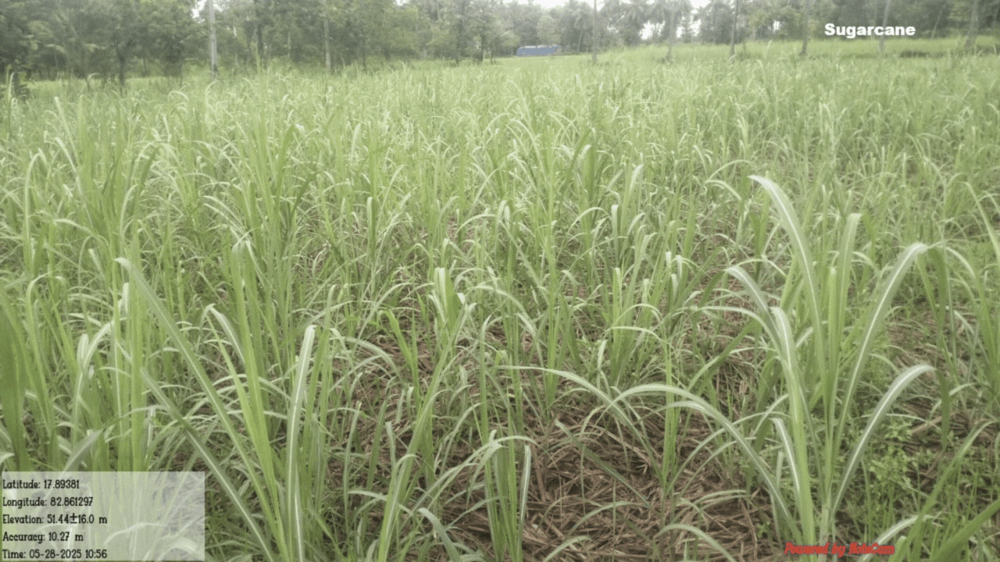

<a id="readme-top"></a>
<!--
*** Thanks for checking out LLM-Vision-Capabilities. If you have a suggestion
*** that would make this better, please fork the repo and create a pull request
*** or simply open an issue with the tag "enhancement".
*** Thanks again!
-->



<div align="center">

[](CODE_OF_CONDUCT.md) [](https://twitter.com/intent/tweet?text=Checkout+this+recipe+for+LLM+Vision&url=https://github.com/AnanthaRajuC/LLM-Vision-Capabilities&hashtags=LLM) [](https://twitter.com/anantharajuc)
</div>

<div align="center">
  <sub>Built with ❤︎ by <a href="https://twitter.com/anantharajuc">Anantha Raju C</a> and <a href="https://github.com/AnanthaRajuC/LLM-Vision-Capabilities/graphs/contributors">contributors</a>
</div>

</br>

<p align="center">
	<a href="https://github.com/AnanthaRajuC/LLM-Vision-Capabilities/blob/master/README.md#llm-vision-capabilities"><strong>Explore the docs »</strong></a>
	<br />
	<br />
	<a href="https://github.com/AnanthaRajuC/LLM-Vision-Capabilities/issues">Report Bug</a>
	·
	<a href="https://github.com/AnanthaRajuC/LLM-Vision-Capabilities/issues">Request Feature</a>
</p>

<!-- PROJECT SHIELDS -->
<!--
*** I'm using markdown "reference style" links for readability.
*** Reference links are enclosed in brackets [ ] instead of parentheses ( ).
-->

|     Service     | Badge | Badge | Badge | Badge | Badge |
|-----------------|-------|-------|-------|-------|-------|
|  **GitHub**     |[](https://github.com/anantharajuc/LLM-Vision-Capabilities/commits/master)|[](https://github.com/anantharajuc/LLM-Vision-Capabilities/pulls)|[](https://github.com/anantharajuc/LLM-Vision-Capabilities/issues)|[](https://github.com/anantharajuc/LLM-Vision-Capabilities/network)|[](https://github.com/anantharajuc/LLM-Vision-Capabilities/stargazers)|
|  **GitHub**     ||[](https://opensource.org/licenses/MIT)

<!-- TABLE OF CONTENTS -->
<details>
  <summary>Table of Contents</summary>
  <ol>
    <li><a href="#llm-vision-capabilities">About The Project</a></li>
    <li><a href="#model-recommendation">Model Recommendation</a></li>
    <li><a href="#output">Smple Output</a></li>
    <li><a href="#contributing">Contributing</a></li>
    <li><a href="#license">License</a></li>
    <li><a href="#contact">Contact</a></li>
  </ol>
</details>

# LLM-Vision-Capabilities

The system is designed to:

- Analyze crop images for health, growth stage, field characteristics, and environmental conditions
- Generate comprehensive text descriptions for semantic search
- Create embeddings for similarity search using both text and image features
- Store everything in ClickHouse for efficient querying

This Python script allows you to identify crops in an image using [Ollama](https://ollama.com/) server to run vision-enabled LLMs locally, such as `llama3.2-vision` or `qwen2.5vl`, without relying on the Hugging Face Transformers library or cloud-based APIs.

It sends an image and a predefined JSON-format prompt to a selected vision model running locally via Ollama, and returns structured information about the crop detected in the image.

By default, it uses a basic prompt, but more detailed prompts (e.g., for disease detection or richer output) can be saved as `.txt` files inside the `assets/` directory. You can create multiple prompt types such as:

- [basic_prompt.txt](/crop_detector/assets/prompts/crop_detection.txt)
- [detailed_prompt.txt](/crop_detector/assets/prompts/crop_analysis.txt)
- multi_crop_prompt.txt
- etc.

These prompts are dynamically loaded and sent to the model, allowing customization without modifying code.

#### Example JSON Prompt Template

```text
Identify the crop in this image and respond ONLY in the following JSON format:

{
  "crop": "<primary crop name>",
  "alternate_names": ["<alternate name 1>", "<alternate name 2>"],
  "color": ["<color 1>", "<color 2>"],
  "confidence": <confidence score from 0 to 1>
}

If any field is not known, return an empty list or null value as appropriate. Do not include any other text.
```

<p align="right">(<a href="#readme-top">back to top</a>)</p>

## Model Recommendation

While the script has been briefly tested with `qwen2.5vl:latest` and `llama3.2-vision:latest`, `qwen2.5vl:latest` is recommended based on local testing due to:

- Reasonable inference times
- Reliable structured JSON responses
- Decent resource usage on a typical commodity laptop

⚠️ **Note:** These observations are based on running the models locally on a standard laptop. Performance and accuracy may vary depending on your system's hardware (CPU, GPU, RAM, etc.).

<p align="right">(<a href="#readme-top">back to top</a>)</p>

## Details
  
- [Getting Started](GETTING_STARTED.MD)
- [Pipeline](PIPELINE.MD)

<p align="right">(<a href="#readme-top">back to top</a>)</p>

## Features

- Uses models like `llama3.2-vision` and `qwen2.5vl` via the Ollama API
- Accepts a local image and outputs structured JSON including:
  - Crop name
  - Alternate crop names
  - Color details
  - Confidence score
  - Metadata like inference time

<p align="right">(<a href="#readme-top">back to top</a>)</p>

## Demo Image


<p align="right">(<a href="#readme-top">back to top</a>)</p>

## Output

The result is a structured JSON response, like:

Crop Detection
```json
{
  "crop": "Sugarcane",
  "alternate_names": [
    "Sugar cane",
    "Cane"
  ],
  "color": [
    "Green",
    "Brown"
  ],
  "confidence": 0.95,
  "metadata": {
    "startDateTime": "2025-06-07T20:58:35.196729",
    "endDateTime": "2025-06-07T21:00:36.916434",
    "duration": 121.72
  }
}
```

Crop Analysis
```json
{
  "crop": "Sugarcane",
  "alternate_names": [
    "Sugar cane",
    "Saccharum officinarum"
  ],
  "color": [
    "green",
    "brown"
  ],
  "confidence": 0.95,
  "overall_description": "The image shows a field of sugarcane with tall, green stalks growing in rows. The field appears to be in a vegetative growth stage, with no visible signs of flowering or fruiting. The soil is visible and appears to be well-tended, indicating a managed agricultural setting.",
  "growth_stage": {
    "stage": "vegetative",
    "estimated_age_months": 6,
    "description": "The sugarcane plants are tall and have a uniform height, indicating they are in the vegetative stage of growth. The presence of young leaves suggests they are not yet mature enough to flower or bear fruit."
  },
  "health_assessment": {
    "overall_health": "good",
    "vigor_score": 0.85,
    "disease_indicators": [
      "empty list"
    ],
    "pest_indicators": [
      "empty list"
    ],
    "stress_indicators": [
      "none_detected"
    ],
    "health_description": "The sugarcane plants appear healthy with no visible signs of disease or pest damage. The leaves are green and there are no signs of yellowing or wilting, indicating good vigor and health."
  },
  "field_characteristics": {
    "planting_pattern": "rows",
    "plant_density": "medium",
    "field_size_estimate": "medium_field",
    "crop_uniformity": "uniform",
    "weed_presence": "none",
    "field_description": "The sugarcane is planted in neat rows, with a consistent spacing between plants. The field appears to be well-maintained, with no visible weeds or other vegetation competing for resources."
  },
  "environmental_context": {
    "setting": "rural",
    "terrain": "flat",
    "surrounding_vegetation": "trees",
    "infrastructure_visible": [
      "irrigation"
    ],
    "weather_conditions": "clear",
    "environment_description": "The field is located in a rural area with a flat terrain and surrounded by trees. There is evidence of irrigation infrastructure, suggesting the field is well-supplied with water. The weather appears clear, indicating favorable growing conditions."
  },
  "growing_conditions": {
    "moisture_level": "adequate",
    "soil_visibility": "clearly_visible",
    "irrigation_evidence": "irrigation",
    "season_indication": "growing_season",
    "conditions_description": "The soil is clearly visible and appears to be well-moistened, indicating adequate irrigation. The growing conditions suggest it is the growing season, with no signs of drought or waterlogging."
  },
  "agricultural_insights": {
    "farming_type": "commercial",
    "management_quality": "good",
    "harvest_readiness": "not_ready",
    "estimated_months_to_harvest": null,
    "management_description": "The sugarcane field is managed with a focus on irrigation, as evidenced by the visible infrastructure. The uniform planting and healthy appearance suggest a good level of management. The field is not yet ready for harvest, as the plants are still in the vegetative stage."
  },
  "recommendations": [
    "Continue with current irrigation practices to ensure adequate moisture levels.",
    "Monitor the field for any signs of pests or diseases and take preventive measures if necessary.",
    "Prepare the field for harvest when the sugarcane reaches the mature stage."
  ],
  "recommendations_summary": "The sugarcane field is in good health and well-managed, with adequate irrigation and uniform planting. The field is not yet ready for harvest, and continued monitoring and irrigation practices are recommended to ensure optimal growth and yield.",
  "image_metadata": {
    "image_quality": "good",
    "lighting_conditions": "natural_daylight",
    "viewing_angle": "ground_level",
    "coverage_area": "field_overview",
    "visual_description": "The image provides a clear overview of the sugarcane field, showing the rows of plants and the surrounding environment."
  },
  "semantic_tags": [
    "sugarcane",
    "vegetative_stage",
    "agricultural_management",
    "irrigation",
    "rural_setting"
  ],
  "search_context": "Sugarcane field in vegetative stage, good health, irrigation managed, rural setting, clear weather",
  "metadata": {
    "startDateTime": "2025-06-08T20:44:27.957857",
    "endDateTime": "2025-06-08T20:50:47.604600",
    "duration": 379.65
  },
  "text_description": "The image shows a Sugarcane crop with colors green, brown. It is in the vegetative stage and approximately 6 months old. Overall health is good, with stress indicators such as none_detected. The field is located in a rural area with flat terrain. Irrigation type is irrigation, and it's currently the growing_season."
}
```

<p align="right">(<a href="#readme-top">back to top</a>)</p>

<!-- CONTRIBUTING -->
## Contributing

Contributions are what make the open source community such an amazing place to learn, inspire, and create. Any contributions you make are **greatly appreciated**.

Kindly refer to [CONTRIBUTING.md](/CONTRIBUTING.md) for important **Pull Request Process** details

1. In the top-right corner of this page, click **Fork**.

2. Clone a copy of your fork on your local, replacing *YOUR-USERNAME* with your GitHub username.

   `git clone https://github.com/YOUR-USERNAME/LLM-Vision-Capabilities.git`

3. **Create a branch**: 

   `git checkout -b <my-new-feature-or-fix>`

4. **Make necessary changes and commit those changes**:

   `git add .`

   `git commit -m "new feature or fix"`

5. **Push changes**, replacing `<add-your-branch-name>` with the name of the branch you created earlier at step #3. :

   `git push origin <add-your-branch-name>`

6. Submit your changes for review. Go to your repository on GitHub, you'll see a **Compare & pull request** button. Click on that button. Now submit the pull request.

That's it! Soon I'll be merging your changes into the master branch of this project. You will get a notification email once the changes have been merged. Thank you for your contribution.

Kindly follow [Conventional Commits](https://www.conventionalcommits.org/en/v1.0.0/) to create an explicit commit history. Kindly prefix the commit message with one of the following type's.

**build**   : Changes that affect the build system or external dependencies (example scopes: gulp, broccoli, npm)  
**ci**      : Changes to our CI configuration files and scripts (example scopes: Travis, Circle, BrowserStack, SauceLabs)  
**docs**    : Documentation only changes  
**feat**    : A new feature  
**fix**     : A bug fix  
**perf**    : A code change that improves performance  
**refactor**: A code change that neither fixes a bug nor adds a feature  
**style**   : Changes that do not affect the meaning of the code (white-space, formatting, missing semicolons, etc.)  
**test**    : Adding missing tests or correcting existing tests  

<p align="right">(<a href="#readme-top">back to top</a>)</p>

## Reporting Issues/Suggest Improvements

This Project uses GitHub's integrated issue tracking system to record bugs and feature requests. If you want to raise an issue, please follow the recommendations below:

* 	Before you log a bug, please [search the issue tracker](https://github.com/AnanthaRajuC/LLM-Vision-Capabilities/search?type=Issues) to see if someone has already reported the problem.
* 	If the issue doesn't already exist, [create a new issue](https://github.com/AnanthaRajuC/LLM-Vision-Capabilities/issues/new)
* 	Please provide as much information as possible with the issue report.
* 	If you need to paste code, or include a stack trace use Markdown +++```+++ escapes before and after your text.  

<p align="right">(<a href="#readme-top">back to top</a>)</p>

## License

Distributed under the MIT License. See [LICENSE.md](/LICENSE) for more information.

<p align="right">(<a href="#readme-top">back to top</a>)</p>

## Contact

Anantha Raju C - [@anantharajuc](https://twitter.com/anantharajuc) - arcswdev@gmail.com

<p align="right">(<a href="#readme-top">back to top</a>)</p>

## Star History

<a href="https://www.star-history.com/#AnanthaRajuC/LLM-Vision-Capabilities&Date">
 <picture>
   <source media="(prefers-color-scheme: dark)" srcset="https://api.star-history.com/svg?repos=AnanthaRajuC/LLM-Vision-Capabilities&type=Date&theme=dark" />
   <source media="(prefers-color-scheme: light)" srcset="https://api.star-history.com/svg?repos=AnanthaRajuC/LLM-Vision-Capabilities&type=Date" />
   
 </picture>
</a>

<p align="right">(<a href="#readme-top">back to top</a>)</p>