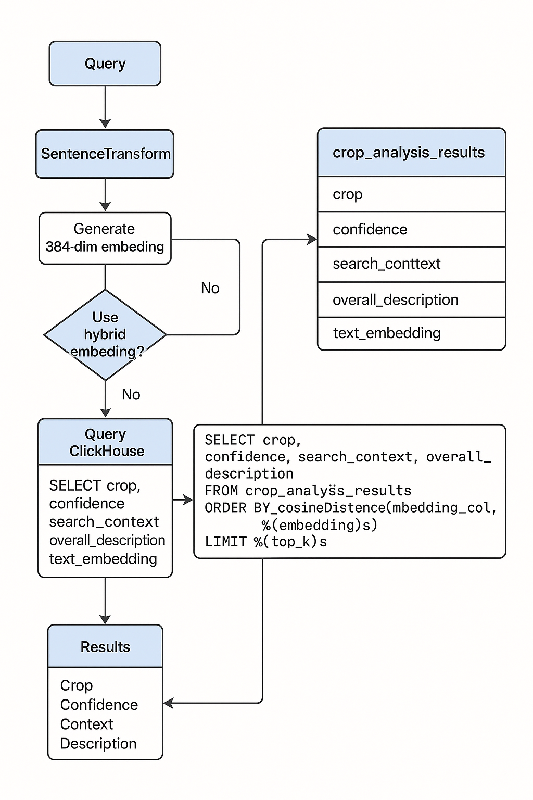

# 🔍 Semantic Crop Search – System Flow

This module implements a **semantic search pipeline** that allows users to search for crop records based on **natural language queries**. It uses sentence embeddings for similarity matching and ClickHouse as a high-performance vector store.

---

## ⚙️ Components Used

- `sentence-transformers`: For converting queries into dense vector embeddings.
- `clickhouse-connect`: For querying ClickHouse over HTTP.
- `python-dotenv`: To load environment variables for config management.

---

## 🧠 Step-by-Step Flow

1. ### **Model Initialization**
   - Load the transformer model: `sentence-transformers/all-MiniLM-L6-v2`.
   - This model outputs 384-dimensional vector embeddings for natural language inputs.

2. ### **Environment Setup**
   - Configuration values like host, port, user, and target table are loaded from `.env`.

3. ### **ClickHouse Client Initialization**
   - A client is initialized using `clickhouse_connect.get_client()` to communicate with the database.

4. ### **Semantic Search Function: `semantic_crop_search(query_text, top_k=5)`**
   - **Input**: A free-text search query (e.g., `"yellowing leaves sugarcane disease"`).
   - **Step 1**: Encode the query using the transformer model into a 384-dim vector.
   - **Step 2**: Choose which embedding column to compare against:
     - `text_embedding`: From `overall_description`, `search_context`, etc.
     - `hybrid_embedding`: Combines both text and image embeddings.
   - **Step 3**: Query the `crop_analysis_results` table using cosine similarity:
     ```sql
     SELECT crop, confidence, search_context, overall_description
     FROM crop_analysis_results
     ORDER BY cosineDistance(<embedding_col>, %(embedding)s)
     LIMIT %(top_k)s
     ```
   - **Output**: Returns the most relevant crop rows with metadata.

---

## 📊 Relevant Database Columns

| Column Name         | Description |
|---------------------|-------------|
| `crop`              | Primary crop name |
| `confidence`        | Model’s confidence in crop identification |
| `search_context`    | Natural language summary used for semantic indexing |
| `overall_description` | A comprehensive summary of the crop's characteristics |
| `text_embedding`    | Dense embedding vector derived from textual fields like description and context |
| `hybrid_embedding`  | Combined vector of both `text_embedding` and `image_embedding`, used if hybrid mode is enabled |

Other fields like health, stage, field, and recommendations exist but are not directly queried in semantic search.

---

## 🧪 Example Usage

```bash
$ python semantic_search.py
```

Example Output:
```
🔍 Result #1
Crop: Sugarcane
Confidence: 0.92
Context: Suspected nutrient deficiency and yellowing observed.
Description: The sugarcane crop appears to be at a mid-growth stage with visible yellowing in leaves.

🔍 Result #2
Crop: Maize
...
```

---

## 📦 Install Requirements

```bash
pip install sentence-transformers clickhouse-connect python-dotenv
```

---

## 🗺️ Flowchart


